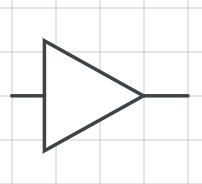
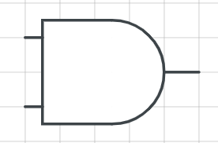
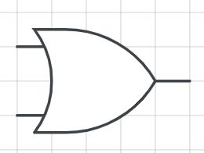
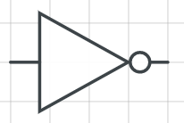
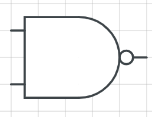
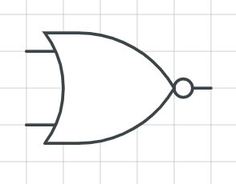
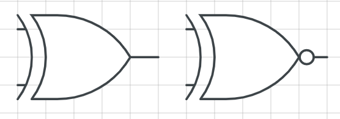
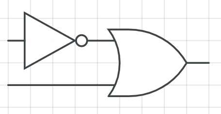
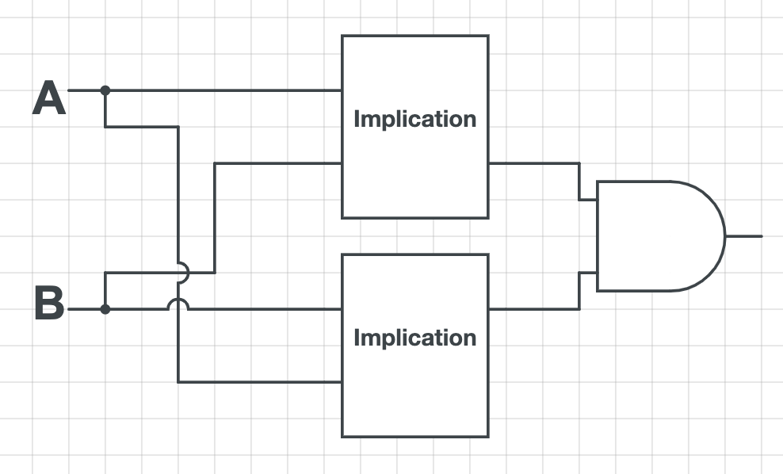

# Boolean Logic

## Boolean

A boolean data type is one that can take on two values, often interpreted as 'True' and 'False'.

```cpp
# C++

bool true_boolean = true;
bool false_boolean = false;
```

## Truth Tables

It is very common to represent boolean expressions in terms of truth tables.

Structurally, truth tables indicate all possible combinations of inputs, along with the output for each.

For demonstration, below is the identity truth table. \($$A$$\)

| Input A | Output B |
| :--- | :--- |
| 0 | 0 |
| 1 | 1 |




In Boolean Algebra, 0 is False and 1 is True.


## Boolean Algebra

> Somewhat formally, boolean algebra follows the given ruleset:
>
> 1. Associativity of $$\land$$ and $$\lor$$
> 2. Commutativity of $$\land$$ and $$\lor$$
> 3. Distributivity of $$\lor$$ over $$\land$$ and $$\lor$$ over $$\land$$
> 4. Identity for $$\land$$ and $$\lor$$
> 5. Annihilator for $$\land$$ and $$\lor$$
> 6. Idempotence of $$\land$$ and $$\lor$$
> 7. Absorption Via: $$ A \land (A \lor B) \equiv A$$ and $$ A \lor (A \land B) \equiv A$$
> 8. Complementation Via: $$A \land \lnot A \equiv 0$$ and $$A \lor \lnot A \equiv 1$$
> 9. Double Negation: $$\lnot (\lnot A) \equiv A$$
> 10. [De Morgan's Laws](boolean-logic.md#de-morgans-laws) \(forward link\)
>
> @source [Wikipedia](https://en.wikipedia.org/wiki/Boolean_algebra)

### Basic Operations

There are three basic boolean operations:

| Boolean Operation | Logical | Algebraic\_1 | Algebraic\_2 | Python | C |
| :--- | :--- | :--- | :--- | :--- | :--- |
| Conjunction | $$\land$$ | $$\times$$ | $$A \times B = min(A, B)$$ | and | && |
| Disjunction | $$\lor$$ | $$+$$ | $$A + B - A \times B = max(A, B)$$ | or | \|\| |
| Negation | $$\lnot$$ | $$-$$ | $$1 - A$$ | not | ! |

#### Conjunction / AND \($$A \land B$$\)

| Input A | Input B | Output C |
| :--- | :--- | :--- |
| 0 | 0 | 0 |
| 0 | 1 | 0 |
| 1 | 0 | 0 |
| 1 | 1 | 1 |



#### Disjunction / OR \($$ A \lor B$$\)

| Input A | Input B | Output C |
| :--- | :--- | :--- |
| 0 | 0 | 0 |
| 0 | 1 | 1 |
| 1 | 0 | 1 |
| 1 | 1 | 1 |



#### Negation / NOT \($$\lnot A$$\)

| Input A | Output B |
| :--- | :--- |
| 0 | 1 |
| 1 | 0 |




Only 2 primitives \(but not any 2 primitives\) are sufficient to construct all other expressions. Soon we will see that [De Morgan's Laws](boolean-logic.md#de-morgans-laws) \(forward link\) show that$$ A \land B = \overline{(\lnot A \lor \lnot B)}$$ and $$  A \lor B = \overline{(\lnot A \land \lnot B)}$$.


### Compound Operations

#### Not And / NAND \($$\bar{\land}$$\)

| Input A | Input B | Output C |
| :--- | :--- | :--- |
| 0 | 0 | 1 |
| 0 | 1 | 1 |
| 1 | 0 | 1 |
| 1 | 1 | 0 |



#### Not Or / NOR \($$\bar{\lor}$$\)

| Input A | Input B | Output C |
| :--- | :--- | :--- |
| 0 | 0 | 1 |
| 0 | 1 | 0 |
| 1 | 0 | 0 |
| 1 | 1 | 0 |



#### Exclusive Or / XOR \($$ A \oplus B$$\)

| Input A | Input B | Output C |
| :--- | :--- | :--- |
| 0 | 0 | 0 |
| 0 | 1 | 1 |
| 1 | 0 | 1 |
| 1 | 1 | 0 |

Xor asserts that one of $$A$$ or $$B$$ are true. This is equivalent to asserting that $$A$$ or $$B$$ is true but $$A$$ and $$B$$ cannot both be true. 

Directly parsing what was just described:

$$
A \oplus B \equiv (A \lor B) \land \lnot (A \land B)
$$

Alternatively, we can enumerate the two true states, producing an [SoP](boolean-logic.md#sum-of-product-sop) \(forward link\):

$$
A \oplus B \equiv (\lnot A \land B) \lor (A \land \lnot B)
$$



#### Material Implication \($$A \rightarrow B$$\)

| Input A | Input B | Output C |
| :--- | :--- | :--- |
| 0 | 0 | 1 |
| 0 | 1 | 1 |
| 1 | 0 | 0 |
| 1 | 1 | 1 |

Material implication is like asserting if it is possible that $$A$$ causes $$B$$. If $$A$$ is false, it is possible that $$A$$ causes $$B$$. However, if $$A$$ is true, the expression takes on $$B$$'s value.

Directly parsing what was just described:

$$
A \rightarrow B \equiv \lnot A \lor B
$$



#### Material Equivalence \($$A \leftrightarrow B$$\)

| Input A | Input B | Output C |
| :--- | :--- | :--- |
| 0 | 0 | 1 |
| 0 | 1 | 0 |
| 1 | 0 | 0 |
| 1 | 1 | 1 |

Material equivalence holds if $$A$$ is true iff \(if and only if\) $$B$$ is true.

Directly parsing what was just described:

$$
A \leftrightarrow B \equiv (A \rightarrow B) \land (B \rightarrow A)
$$



### De Morgan's Laws

The following two statements hold true for Boolean Algebra.

$$
A \land B = \overline{(\lnot A \lor \lnot B)}
$$

$$
A \lor B = \overline{(\lnot A \land \lnot B)}
$$

Effectively, conversion of $$\land$$ to $$\lor$$ or $$\lor$$ to $$\land$$ involves negating both arguments as well as the whole expression. This is also used to 'distribute' negation, which is [not considered distributive](boolean-logic.md#boolean-algebra).

## Standard Forms

There are two standard forms that every boolean expression can reduce to.

### Sum of Product \(SoP\)

A sum of product expression is one involving a single sum of product expressions. 

$$
A \oplus B \equiv (\lnot A \land B) \lor (A \land \lnot B)
$$

You can produce a SoP expression from a truth table by summing the multiplied conditions of each possible input that produces a true output. In essence, we are enumerating all cases which yield True and saying that at least one of them is fulfilled.

| Input A | Input B | Output C |
| :--- | :--- | :--- |
| 0 | 0 | 0 |
| 0 | 1 | 1 |
| 1 | 0 | 1 |
| 1 | 1 | 0 |

In the above example for XOR,  the term $$(\lnot A \land B)$$ corresponds to the second row and the term $$(A \land \lnot B)$$ corresponds to the third row.

### Product of Sum \(PoS\)

A product of sum expression is one involving a single product of sum expressions.

$$
A \oplus B \equiv (A \lor B) \land (\lnot A \lor \lnot B)
$$

You can produce a PoS expression from a truth table by multiplying the added, negated conditions of each possible input that produces a false output. In essence, we are enumerating all cases which yield False and saying that all of them are unfulfilled \(because at least one input from each failure case is inverted / negated\).

| Input A | Input B | Output C |
| :--- | :--- | :--- |
| 0 | 0 | 0 |
| 0 | 1 | 1 |
| 1 | 0 | 1 |
| 1 | 1 | 0 |

In the above example for XOR, the term $$(A \lor B)$$ corresponds to the first row and the term $$(\lnot A \lor \lnot B)$$ corresponds to the fourth row.

