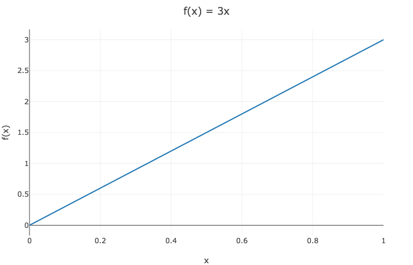
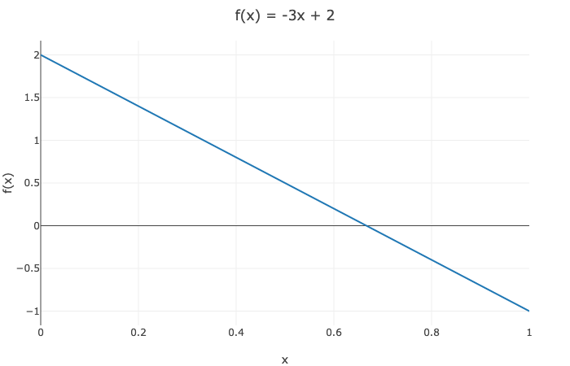

# Linear Algebra

## Linear

Informally, a linear [transformation](../../../cs/programming/functions.md#transformations) is one that strictly scales and adds inputs.

> Somewhat formally, a linear function $$f : X \rightarrow Y$$, where $$X$$ and $$Y$$ are both [vector spaces](vectors/vector-space.md) \(forward link\), satisfies two properties.
>
> 1. Vector Addition: $$f(\vec{a} + \vec{b}) = f(\vec{a}) + f(\vec{b})$$ 
> 2. Scalar Multiplication: $$ f(s \vec{a}) = s f(\vec{a})$$
>
> @source [Wikipedia](https://en.wikipedia.org/wiki/Linear_function)

As we will see, matrix multiplication on a vector is a linear transformation, so we can use vectors and matrices to model and manipulate linear systems.

## Affine

Informally, an affine transformation is one that strictly scales and adds inputs, plus a constant offset.

> Somewhat formally, an affine function $$f : X \rightarrow Y$$, where $$X$$ and $$Y$$ are both [vector spaces](vectors/vector-space.md) \(forward link\), preserves five properties.
>
> 1. Collinearity Between Points
> 2. Parallelism
> 3. Convexity
> 4. Ratios of Lengths of Parallel Line Segments
> 5. Barycenters of Weighted Collections of Points
>
> @source [Wikipedia](https://en.wikipedia.org/wiki/Affine_transformation)


Certain functions you may hold to be linear may actually be affine. For example, $$f(x) = ax + b$$ is affine in $$x$$, and linear in $$x$$ iff $$b=0$$. For any nonzero $$b$$, one can easily pose a counterexample to the vector addition component of linearity: $$f(0+0) = b \neq f(0) + f(0) = 2b$$


## Structure Definitions

### Scalar

A scalar is a single numerical value.

$$
s = 6
$$

### Vector

A vector is a one-dimensional list of scalars.

$$
\vec{v}_{1} = \begin{bmatrix} 1 \\ 2 \\ 3 \end{bmatrix}
\vec{v}_{2} = \begin{bmatrix} 4 \\ 5 \\ 6 \end{bmatrix}
\vec{v}_{3} = \begin{bmatrix} 7 \\ 8 \\ 9 \end{bmatrix}
$$

### Matrix

A matrix is a one-dimensional list of equal-length vectors \(2D grid of scalars\).

$$
M = 
\begin{bmatrix} 
1 \ 4 \ 7 \\
2 \ 5 \ 8 \\
3 \ 6 \ 9
\end{bmatrix}
=
\begin{bmatrix}
v_{1} \ v_{2} \ v_{3}
\end{bmatrix}
$$

