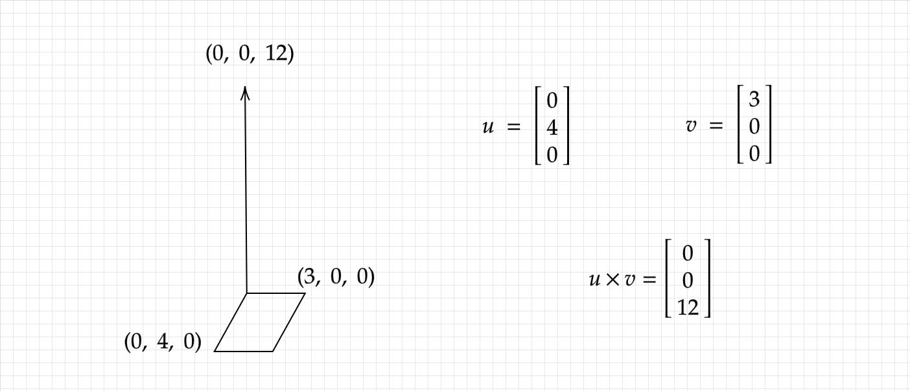

# Vector Operations

## Scaling

Vector-scalar multiplication is computed entry-wise.

$$
2
*
\begin{bmatrix} 2 \\ 3 \\ 4 \end{bmatrix}
=
\begin{bmatrix} 4 \\ 6 \\ 8 \end{bmatrix}
$$

```python
#!/usr/bin/python

import numpy as np

# w/ builtin
def scale(s, v):
    return s * v
    
# w/out builtin (for demonstration purposes)
def scale_alt(s, v):
    return np.array([s * v_i for v_i in v])
```

## Norms and Normalization

### Norm

Informally, the norm of a vector is its magnitude.

> Somewhat formally, a norm is a function $$ p : X \rightarrow \mathbb{R}$$ on a vector in a vector space $$X$$ over a subfield of $$\mathbb{C^n}$$ \(vectors of $$n$$ complex numbers\) that satisfies the following properties:
>
> 1. Subadditivity / Triangle Inequality: $$ p(\vec{a} + \vec{b}) \leq p(\vec{a}) + p(\vec{b})$$
>    * Meaning that the norm of a sum of vectors is at most the sum of their norms.
> 2. Homogeneity: $$p(s \vec{x}) = |s| p(\vec{x})$$
>    * Meaning that scalars applied on a vector scale the norm the same amount.
> 3. Positive Definiteness: $$p(\vec{x}) \geq 0$$ and $$ p(\vec{x}) = 0$$ iff $$\vec{x} = \vec{0}$$
>    * Meaning that all norms are positive, except those on $$\vec{0}$$, which are 0.

> @source [Wikipedia](https://en.wikipedia.org/wiki/Norm_%28mathematics%29)

There are many different norms that all quantify magnitude in slightly different ways.

#### Euclidian Norm \(2-Norm\)

You are probably most familiar with the euclidian norm / 2-norm, which corresponds to distance as we know it in the physical world \($$\mathbb{R^3}$$\). The norm is defined below.

$$
\lVert \vec{u} \rVert _{2}
=
\sqrt{\sum_{i = 1}^{n}{\vec{u}_{i}^{2}}}
$$

```python
#!/usr/bin/python

import numpy as np
import math

# w/ builtin
def euclidian_norm(v):
    return np.linalg.norm(v) # optional 2nd argument indicates p-norm

# w/out builtin (for demonstration purposes)
def euclidian_norm_alt(v):
    return math.sqrt(sum([v_i * v_i for v_i in v]))
```

Note: If someone refers to the contextless 'norm' of a vector, they are probably referring to the euclidian norm.

#### P-Norm

The general p-norm is defined below.

$$
\lVert \vec{u} \rVert _{p}
=
(\sum_{i = 1}^{n}{\lVert \vec{u}_{i} \rVert ^{p}})^{\frac{1}{p}}
$$

Different norms are useful for measuring different kinds of magnitudes you may be interested in.

For example, the 1-norm, sometimes known as the Manhattan norm \(defined as $$ \lVert \vec{u} \rVert _{1} = \sum_{i = 1}^{n}{\lVert \vec{u}_{i} \rVert}$$\), might be useful for calculating the total driving distance between two locations in a dense grid-like city \(provided that your vector space is aligned with the street axes\).


Norms can be very useful for calculating error. To use a norm in this way, you will typically want to formulate a vector that describes how different your state vector $$\vec{v}$$ is from the desired 'target' state vector $$\vec{u}$$. You can calculate this using the expression $$\vec{u} - \vec{v}$$, and then apply the most relevant norm to calculate the error.


### Normalization

Vectors that have unit norm \($$\lVert \vec{u} \rVert _p = 1$$\) are called unit vectors.

Performing normalization on a vector using a specific norm results in a unit vector for that norm.

Below is an equation for the vector $$\vec{u}$$, the euclidian normalized $$\vec{v}$$.

$$
\vec{u} = \frac{\vec{v}}{\lVert \vec{v} \rVert}
$$

Normalizing a vector is a useful for extracting its direction / orientation \(orientation of data, not `np.shape`\).

```python
#!/usr/bin/python

import numpy as np

def normalized(v):
    norm = np.linalg.norm(v)
    if norm == 0:
        return v
    return v / norm
```


## Addition

Vector-vector addition is computed entry-wise, and is only defined for vectors of the same dimensions.

$$
\begin{bmatrix}  2 \\ 3 \\ 4 \end{bmatrix}
+
\begin{bmatrix} 7 \\ 4 \\ 10 \end{bmatrix}
=
\begin{bmatrix} 9 \\ 7 \\ 14 \end{bmatrix}
$$

Since we can negate all of the elements of a vector without any trouble, subtraction is can be reduced to element-wise addition after negating the subtrahend \(second argument\).

```python
#!/usr/bin/python

import numpy as np

# w/ builtin
def add(u, v):
    return u + v
    
# w/out builtin (for demonstration purposes)
def add_alt(u, v):
    if u.shape != v.shape:
        raise ValueError("vectors are not the same length")
    sum = np.array(u)
    for i in range(len(v)):
        sum[i] += v[i]
    return sum
```

## Multiplication

Vector-vector multiplication comes in several different flavors.

### Hadamard Product

The Hadamard product is the element-wise product of two vectors.

$$
\begin{bmatrix}  2 \\ 3 \\ 4 \end{bmatrix}
\circ
\begin{bmatrix} 7 \\ 4 \\ 10 \end{bmatrix}
=
\begin{bmatrix} 14 \\ 12 \\ 40 \end{bmatrix}
$$

```python
#!/usr/bin/python

import numpy as np

# w/ builtin
def hadamard_product(u, v):
    return u * v

# w/out builtin (for demonstration purposes)
def hadamard_product_alt(u, v):
    if u.shape != v.shape:
        raise ValueError("vectors are not the same length")
    h_product = np.array(u)
    for i in range(len(v)):
        h_product[i] *= v[i]
    return h_product
```

### Inner Product

Informally, the inner product of two vectors is a combined measure of their magnitudes and similarity.

Inner products are denoted using the following notation, $$\langle \vec{u}, \vec{v} \rangle$$.

> Somewhat formally, an inner product is a function $$ V \times V \rightarrow \mathbb{F}$$ \(where $$\mathbb{F}$$is either $$\mathbb{R}$$ or $$\mathbb{C}$$\) that satisfies the following properties:
>
> 1. Linearity in the first argument:
>    1.  $$ \langle s\vec{a}, \vec{b} \rangle  = s \langle \vec{a}, \vec{b} \rangle$$
>    2. $$\langle \vec{a} + \vec{c}, \vec{b} \rangle = \langle \vec{a}, \vec{b} \rangle + \langle \vec{c}, \vec{b} \rangle$$
> 2. Conjugate Symmetry: $$\langle \vec{a}, \vec{b} \rangle =  \overline{\langle \vec{b}, \vec{a} \rangle}$$
>    * For real number vectors, this means that $$ \langle \vec{a}, \vec{b} \rangle = \langle \vec{b}, \vec{a} \rangle$$
> 3. Positive Definiteness: $$\langle \vec{a}, \vec{a} \rangle \geq 0$$ and $$ \langle \vec{a}, \vec{a} \rangle = 0$$ iff $$\vec{a} = \vec{0}$$
>    * Meaning that all self-inner products are positive, except those on $$\vec{0}$$, which are 0.

> @source [Wikipedia](https://en.wikipedia.org/wiki/Inner_product_space)

In the remainder of the Devices and Systems I section I will use the term inner product and dot product interchangeably.

### Euclidian Inner Product / Dot Product / Scalar Product

The euclidian inner product is a specific kind of inner product defined for vectors in $$\mathbb{R^n}$$. It is the sum of their element-wise products of the two vectors, resulting in a scalar.

$$
\vec{u} \cdot \vec{v}
=
\sum_{i=1}^{n}{\vec{u}_{i} * \vec{v}_{i}}
$$

As stated in the inner product section, the dot product is a useful measure of the similarity of two vectors.

$$
\begin{bmatrix}  2 \\ 3 \\ 4 \end{bmatrix}
\cdot
\begin{bmatrix} 7 \\ 4 \\ 10 \end{bmatrix}
= 14 + 12 + 40 = 66
$$

```python
#!/usr/bin/python

import numpy as np

# w/ builtin
def dot(u, v):
    return np.dot(u, v)
    
# w/out builtin (for demonstration purposes)
def dot_alt(u, v):
    if u.shape != v.shape:
        raise ValueError("vectors are not the same length")
    dot_product = 0
    for i in range(len(u)):
        dot_product += u[i] * v[i]
    return dot_product
```

### Cross Product

The cross product of two vectors $$\vec{u}$$ and $$\vec{v}$$ in $$\mathbb{R^3}$$ is a vector that is orthogonal to both $$\vec{u}$$ and $$\vec{v}$$ and whose magnitude is equal to the area on the parallelogram formed between them.

Below is a diagram of a very simple cross product.




The cross product is given as the following:

$$
\vec{u} \times \vec{v}
=
\begin{bmatrix} 
\vec{u}_{2} \vec{v}_{3} - \vec{u}_{3} \vec{v}_{2}  \\
\vec{u}_{3} \vec{v}_{1} - \vec{u}_{1} \vec{v}_{3} \\ 
\vec{u}_{1} \vec{v}_{2} - \vec{u}_{2} \vec{v}_{1}
\end{bmatrix}
$$

Cross products are only nonzero in $$\mathbb{R^3}$$ and $$\mathbb{R^7}$$, so we will only discuss the $$\mathbb{R^3}$$ cross product.

```python
#!/usr/bin/python                                                               

import numpy as np

# w/ builtin                                                                    
def cross(u, v):
    return np.cross(u, v)

# w/out builtin (for demonstration purposes)                                    
def cross_alt(u, v):
    if u.shape != v.shape != (3):
        raise ValueError("vectors are not of length 3")
    return np.array([
                    u[1] * v[2] - u[2] * v[1],
                    u[2] * v[0] - u[0] * v[2],
                    u[0] * v[1] - u[1] * v[0]
                    ])
```

#### Cross Product Derivation


Disclaimer: The following cross product derivation depends on some material about [vector spaces](vector-space.md).


You can derive an expression for the cross product of two vectors $$\vec{u}$$ and $$\vec{v}$$ in $$\mathbb{R^3}$$ just by using the [orthonormal basis](vector-space.md#orthonormal-basis) \(forward link\) in $$\mathbb{R^3}$$ \($$\vec{i} \ \vec{j} \ \vec{k}$$\) and the distributive property.

$$
\vec{u} = \vec{u}_{1} * \vec{i} + \vec{u}_{2} * \vec{j} + \vec{u}_{3} * \vec{k}
\\
\vec{v} = \vec{v}_{1} * \vec{i} + \vec{v}_{2} * \vec{j} + \vec{v}_{3} * \vec{k}
$$

$$
\vec{u} \times \vec{v} 
= 
(\vec{u}_{1} * \vec{i} + \vec{u}_{2} * \vec{j} + \vec{u}_{3} * \vec{k}) \times  (\vec{v}_{1} * \vec{i} + \vec{v}_{2} * \vec{j} + \vec{v}_{3} * \vec{k})
$$

$$
\vec{u} \times \vec{v}
=
\vec{u}_{1} \vec{v}_{1} * \vec{i} \times \vec{i} + \vec{u}_{1} \vec{v}_{2} * \vec{i} \times \vec{j} + \vec{u}_{1} \vec{v}_{3} * \vec{i} \times \vec{k}
\\ +
\vec{u}_{2} \vec{v}_{1} * \vec{j} \times \vec{i} + \vec{u}_{2} \vec{v}_{2} * \vec{j} \times \vec{j} + \vec{u}_{2} \vec{v}_{3} * \vec{j} \times \vec{k}
\\ +
\vec{u}_{3} \vec{v}_{1} * \vec{k} \times \vec{i} + \vec{u}_{3} \vec{v}_{2} * \vec{k} \times \vec{j} + \vec{u}_{3} \vec{v}_{3} * \vec{k} \times \vec{k}
$$

$$
\vec{u} \times \vec{v}
=
\vec{u}_{1} \vec{v}_{1} * \vec{0} + \vec{u}_{1} \vec{v}_{2} * \vec{k} + \vec{u}_{1} \vec{v}_{3} * -\vec{j} 
\\ + 
\vec{u}_{2} \vec{v}_{1} * -\vec{k} + \vec{u}_{2} \vec{v}_{2} * \vec{0} + \vec{u}_{2} \vec{v}_{3} * \vec{i}
\\ +
\vec{u}_{3} \vec{v}_{1} * \vec{j} + \vec{u}_{3} \vec{v}_{2} * -\vec{i} + \vec{u}_{3} \vec{v}_{3} * \vec{0}
$$

$$
\vec{u} \times \vec{v}
=
(\vec{u}_{2} \vec{v}_{3} - \vec{u}_{3} \vec{v}_{2}) * \vec{i}
+
(\vec{u}_{3} \vec{v}_{1} - \vec{u}_{1} \vec{v}_{3}) * \vec{j}
+ 
(\vec{u}_{1} \vec{v}_{2} - \vec{u}_{2} \vec{v}_{1}) * \vec{k}
$$

$$
\vec{u} \times \vec{v}
=
\begin{bmatrix} 
\vec{u}_{2} \vec{v}_{3} - \vec{u}_{3} \vec{v}_{2}  \\
\vec{u}_{3} \vec{v}_{1} - \vec{u}_{1} \vec{v}_{3} \\ 
\vec{u}_{1} \vec{v}_{2} - \vec{u}_{2} \vec{v}_{1}
\end{bmatrix}
$$


Because the cross product takes on the magnitude of the parallelogram defined between the two input vectors, $$\vec{u} \times \vec{u}$$ is $$\vec{0}$$.


